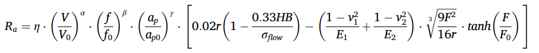
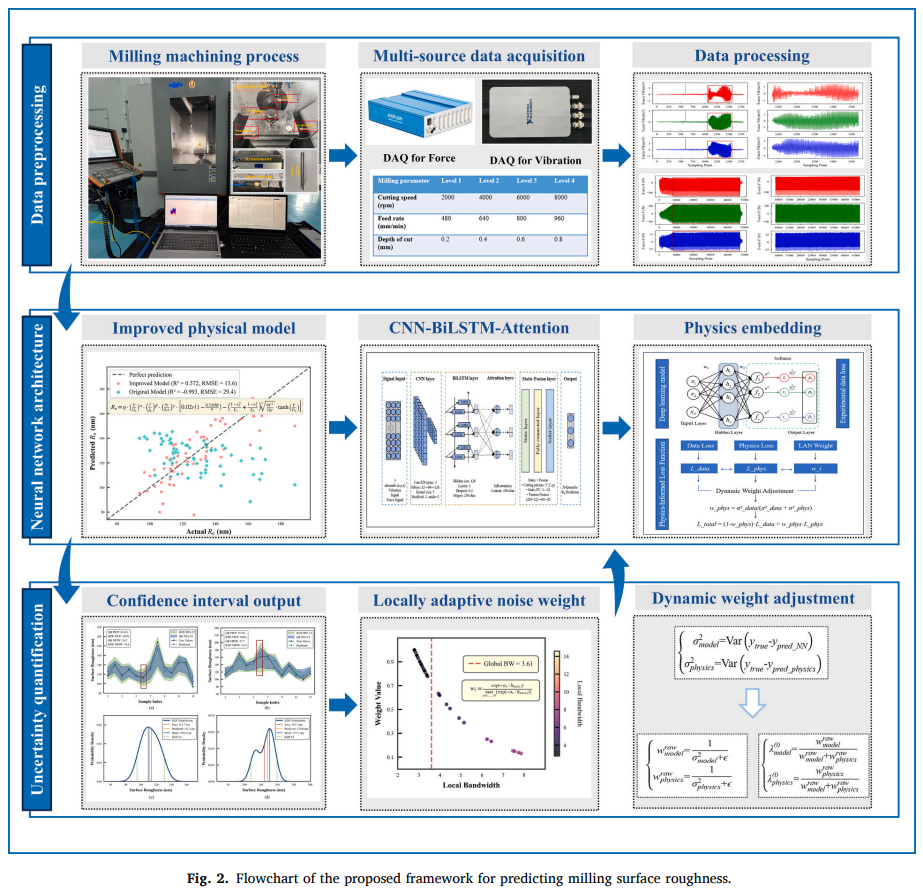
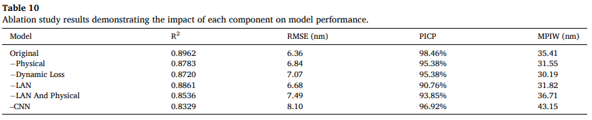

# PrecisionPINN-ABKDE: uncertainty-weighted physics-informed neural network with adaptive bandwidth kernel density estimation for milling surface roughness prediction

## 基礎資訊
*   **期刊/會議**：Mechanical Systems and Signal Processing (MSSP) (IF: 7.9 / Q1)
*   **作者與單位**：Shuai Yuan, Long Bai, Jianfeng Xu 等 @ 華中科技大學機械科學與工程學院 (State Key Laboratory of Intelligent Manufacturing Equipment and Technology, HUST)
*   **論文網址**：https://doi.org/10.1016/j.ymssp.2026.114228
*   **原始碼/實作**：Not Provided
*   **技術關鍵字**：`#PINN` `#Milling` `#Surface-Roughness` `#Uncertainty-Quantization` `#Deep-Learning`

## 研究摘要

這篇論文針對 **五軸銑削過程中的表面粗糙度（Surface Roughness）預測** 提出了一套結合 **PrecisionPINN-ABKDE（結合自適應頻寬核密度的動態權重物理資訊神經網路）** 的新型框架，旨在解決現有 **SOTA (State-of-the-art)** 數據驅動模型在加工雜訊下容易過度擬合、且無法提供可靠的預測不確定性量化（Uncertainty Quantization）的核心痛點。其技術機制在學術上可被視為一個 **「具備動態先驗約束與雜訊免疫的自適應評估系統」**，即系統在接受多源感測訊號驅動的同時，受限於底層「彈塑性變形與切削力學」的物理控制方程約束，並透過核密度估計來建模預測結果的概率分佈。

### **核心方法論拆解**
1.  **物理空間動態嵌入**：將常規的 **彈塑性變形模型** 引入正規化切削參數與非線性力學校正項（`Eq. 7`），作為正則化約束整合進 CNN-BiLSTM-Attention 網路的 Loss Function 中，並讓物理參數（$\eta, \alpha, \beta, \gamma$）具備可學習性。
2.  **LAN (Locally Adaptive Noise) 機制與動態權重**：利用自適應頻寬核密度估計（ABKDE）計算每個樣本的局部機率密度，動態賦予低雜訊樣本較高權重以抑制 Outliers；同時利用全域預測變異數動態分配物理 Loss 與數據 Loss 之間的佔比。
3.  **QR-ABKDE 區間估計**：結合分位數迴歸（Quantile Regression）與 ABKDE，不僅輸出單點的粗糙度預測，還能輸出涵蓋率高達 98.46% 的預測信賴區間（Confidence Intervals）。

## 實務分析

### **資料處理流程**
其流程從原始的高頻感測器數據（如：`10,000 Hz Cutting Force` 與 `500 Hz Vibration Signals`）出發，經過基於閾值的穩態截取（去除進退刀雜訊）與 Z-score 標準化後，重採樣對齊為固定長度（600 samples）的時序特徵張量，再與靜態的切削參數（轉速、進給、切深）進行特徵融合。建議參考論文中的 **[Figure 2: Flowchart of the proposed framework]**，該架構圖清晰展示了多源數據流（Multi-source Data）如何與物理約束算子及 QR-ABKDE 模組進行交互與對齊。

### **落地瓶頸與風險**
1.  **收斂穩定性 (Numerical Stability) 與梯度衝突**：本模型具有極其複雜的多目標優化損失函數（數據分位數損失 + 物理約束損失 + 權重正則化）。實作時物理參數與網路權重必須依賴嚴格的 **「階段性預熱 (Phased warm-up, 30 epochs)」** 與 **不同的學習率**，否則極易在邊界條件附近出現梯度發散。
2.  **極端的運算開銷 (Computational Overhead)**：LAN 權重機制要求在「每一個 Epoch」針對「每一個 Sample」重新計算全局與局部頻寬（Bandwidth）及核密度。在工業產線的 Edge IPC（工業電腦）上進行即時訓練或微調時，這種運算複雜度會帶來龐大的延遲負載。
3.  **環境穩定性與物理假設失效**：改良版物理模型（`Eq. 7`）強烈依賴切削力特徵。在面對非均質材料或刀具發生微崩刃時，實際力學反饋會偏離其彈塑性變形假設，可能導致物理約束項反而成為干擾網路收斂的毒藥。

## 落地性評析

### **實驗與數據分析**
*   **極端數據匱乏與過擬合質疑 (Overfitting Suspicion)**：這是一顆巨大的紅旗！論文作者構建了一個極度龐大複雜的 CNN-BiLSTM-Attention 網路，但整個實驗居然 **「只有 64 組正交切削數據 (64 orthogonal cutting tests)」**（詳見 Section 4.1）。在區區 64 筆樣本上訓練這類重型深度學習模型，即使使用了 Cross-validation，其獲得的優異指標（$R^2 = 0.8962$）極大機率是過度擬合的結果。
*   **刻意避開核心變數的櫻桃採擷 (Cherry-picking in Setup)**：作者在實驗設定中聲稱，為了短期實驗，採用了 PCD 刀具加工 AlSi40 鋁合金，因此 **「忽略了刀具磨耗 (Tool Wear) 的影響」**。但在真實的連續工業銑削場景中，刀具磨耗是導致表面粗糙度劣化的最核心物理變數。一個剔除了刀具磨耗的物理模型，等同於溫室裡的學術玩具，極大限縮了其在真實產線的落地價值。
*   **基準對比分析 (Baseline Scrutiny)**：請查看 **[Table 7]**。作者拿來對比的 Transformer 或普通 CNN/LSTM 在如此稀疏的數據量下，表現本來就會極差。這是典型的不公平對比（Unfair baseline comparison）。

.png)

### **未來工作**
*   **理論貢獻評估**：該效能提升在多大程度上源於物理公式的引入？根據其消融實驗 **[Table 10: Ablation study]**，移除 CNN 模組導致的效能下降最大（$R^2$ 降至 0.8329），移除物理模組僅降至 0.8783。這證明其卓越表現本質上是靠「深度學習的強大特徵提取」與「LAN 雜訊過濾」強行擬合出來的，物理公式的實質貢獻被誇大了。

*   **工程優化建議**：
    *   **砍掉繁雜的動態權重與 KDE**：若要在現有機台落地，強烈建議捨棄在每個 epoch 動態計算 KDE 的複雜機制。
    *   **技術替代**：針對僅有幾十到幾百筆數據的「極小樣本 + 不確定性量化」工業場景，直接採用 **高斯過程迴歸 (Gaussian Process Regression, GPR)** 或 **貝氏神經網路 (BNN)** 會是更輕量、更符合數學直覺且易於維護的選擇。
