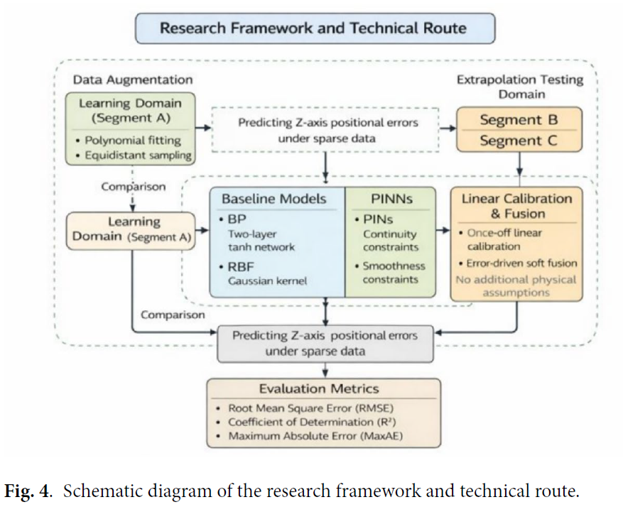
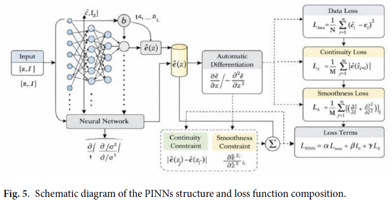
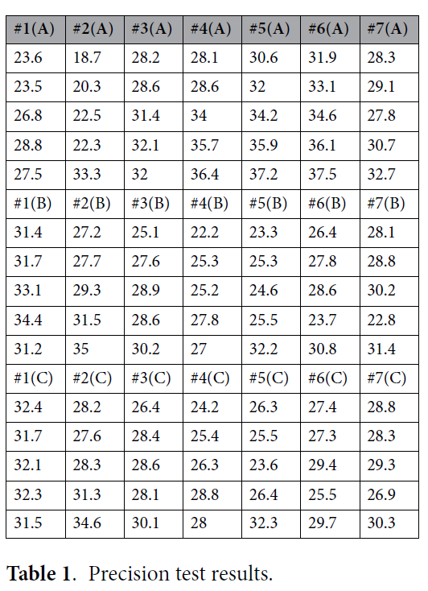
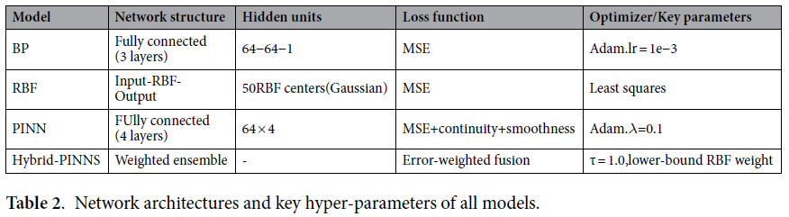

# Research on precision prediction of heavy-duty lathes based on hybrid PINNS neural network

## 基礎資訊
*   **期刊/會議**：Scientific Reports (Nature Portfolio) (Published: 2026)
*   **作者與單位**：Ruiqi Wang @ Nanchang University, Hao Jing @ UCSI University, Manzhi Yang @ Xi'an University of Science and Technology
*   **論文網址**：https://doi.org/10.1038/s41598-026-42143-5
*   **原始碼/實作**：Not Provided
*   **技術關鍵字**：`#Hybrid-PINNs` `#Heavy-duty-Lathe` `#Positioning-Error` `#Sparse-Data` `#Extrapolation`

## 研究摘要 

這篇論文針對 **重型數控（CNC）車床在稀疏測量數據（小樣本）下的 Z 軸定位精度預測** 提出了一套結合 **Hybrid-PINNs（混合物理資訊神經網路）與誤差驅動軟融合** 的新型框架，旨在解決現有 **SOTA (State-of-the-art)** 數據驅動模型在小樣本環境下缺乏物理一致性（Physical Consistency）且外插能力（Extrapolation）薄弱、容易產生非物理震盪的核心痛點。其技術機制在學術上可被視為一個 **「具備工程先驗約束的動態演化系統」**，即系統在接受數據特徵驅動的同時，受限於底層空間連續性與平滑度的邊界約束，達成高保真度與高穩定性的建模。

### **核心方法論拆解**
1.  **物理空間嵌入（Weak Physics Constraints）**：放棄複雜的熱力耦合控制方程式，改將工程常識「定位誤差的連續性（一階導數）與平滑度（二階導數）」轉化為微分正則化項，並整合進神經網路的 **Loss Function** 中。
2.  **數據擴充與預處理（Data Augmentation）**：在訓練區間（Section A）使用 6 階多項式擬合（6th-order polynomial fitting）提取低頻非線性趨勢，並進行等距採樣以解決原始數據過度稀疏的問題。
3.  **多模型加權融合（Error-driven Weighted Fusion）**：先進行一次性線性校準消除尺度偏差，接著利用基於驗證集 RMSE 的 Softmax 函數，自動將 BP、RBF 與 PINN 三個模型的預測結果進行「誤差驅動的自適應軟融合（Soft weighting fusion）」。

## 實務分析

### **資料處理流程**
其流程從原始雙頻雷射干涉儀數據出發，先切分為 A（訓練）、B/C（外插驗證）三個區段。數據經過 **6 階多項式擴充與 Z-score 標準化（Standardization）** 後，提取為符合物理模型輸入的座標張量（包含座標 $z$ 與 one-hot 編碼的區段 $s$）。建議參考論文中的 **[figure 4: Schematic diagram of the research framework and technical route]** 以及 **[figure 5: PINNs structure]**，該架構圖清晰展示了數據流如何與自動微分算子（Automatic Differentiation）進行交互與對齊。

### **落地瓶頸與風險**
1.  **收斂穩定性 (Numerical Stability) 與梯度病態**：物理約束項包含一階與二階自動微分計算。在多目標優化中（$\lambda = 0.1$），高階導數的數值極易與 MSE Loss 產生梯度量級差異（Gradient Pathologies），導致模型在訓練初期極難收斂，需依賴精細的學習率調度或動態權重（Dynamic Re-weighting）。
2.  **龍格現象 (Runge's Phenomenon) 的溢位風險**：Data Pipeline 強行使用了 6 階多項式進行數據擴充。在工程落地時，若空間座標 $z$（高達數萬 mm）未進行極其嚴格的歸一化，高階多項式運算極易導致浮點數溢位或邊緣劇烈震盪。
3.  **運算開銷 (Computational Overhead)**：PINN 依賴 PyTorch/TensorFlow 的 `create_graph=True` 來計算二階導數，在訓練階段會佔用大量 GPU 記憶體；此外，部署時維護三個獨立模型（BP, RBF, PINN）的 Ensemble 架構，推論與後續更新維護成本過高。

## 落地性評析

### **實驗與數據分析**
*   **基準對比分析 (Baseline Scrutiny)**：請詳細查看論文中的 **[Table 2: Network architectures]**。作者為了凸顯 PINN 的強大，對比的對照組居然是極度老舊的 **3層傳統 BP 神經網路與基本的 RBF 網路**。在面對「極小樣本連續性預測」的任務時，業界標準通常是採用內建不確定性量化的高斯過程迴歸（Gaussian Process Regression, GPR）或 SVR，這種「打稻草人」的比較方式嚴重誇大了該模型的優勢。
*   **極端數據分佈質疑 (Cherry-picking Suspicion)**：這是一個巨大的紅旗！根據 **[Table 1]** 與論文描述，每個 300 mm 的測試區段（Section A, B, C）**竟然只有 7 個測量點**！作者在僅有 7 個數據點的 Section A 強行套用 **「6 階多項式 (6th-order polynomial)」** 進行擬合與擴充。在數學上，7 個點配上 6 階多項式會達到 100% 過度擬合（完美穿過所有點但區間內瘋狂震盪），神經網路學到的其實是這條被人工扭曲的曲線，而非真實物理規律。

### **未來工作**
*   **理論貢獻**：該效能提升（高達 85% 的誤差降低）在極大程度上並非源於「物理公式（因為他們根本沒有使用真正的熱力學公式，只是用了平滑度導數）」，而是透過繁雜的 **「模型融合 (Ensemble) + 線性校準」** 強行取巧擬合。這是一篇標準的「工程 Trick 堆疊」大於「理論創新」的論文。
*   **優化建議**：
    *   **砍掉冗餘架構**：若要在現有機台落地，強烈建議捨棄這種危險的 6 階多項式擴充與繁雜的三模型 Ensemble（BP+RBF+PINN）。
    *   **技術替代**：直接考慮導入 **Bayesian PINNs (B-PINNs)** 或 **Gaussian Processes** 來取代這套複雜的系統。這些演算法天生適合小樣本學習，且能給出「預測不確定性區間（Confidence Intervals）」，對於應對導軌錯位（rail-joint misalignments）等非連續物理邊界條件（Corner Cases）具備更高的工業實用價值。
