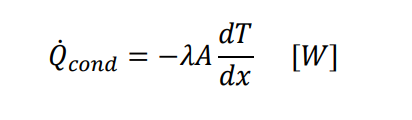
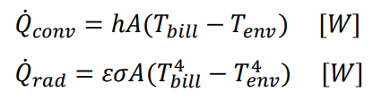
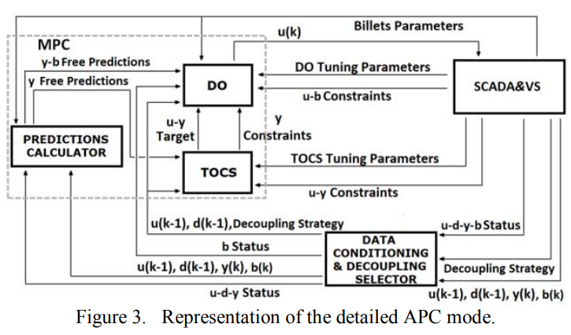
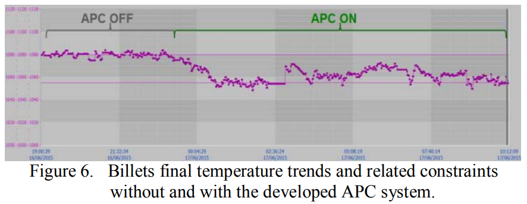

# [2017] Pusher Furnace Adaptive MPC

## 基礎資訊 

| 欄位 | 內容 |
|------|------|
| 期刊 / 會議 | Advanced Control of Industrial Processes (AdCONIP) 2017 |
| 作者與單位 | G. Astolfi, L. Barboni, F. Cocchioni, C. Pepe, S. M. Zanoli @ Università Politecnica delle Marche & i.Process S.r.l., Italy |
| 論文網址 | N/A |
| 原始碼 / 實作 | N/A（論文提及為專有軟體工具 Proprietary software tool） |
| 技術關鍵字 | `#Model-Predictive-Control` `#Virtual-Sensor` `#Reheating-Furnace` `#Energy-Optimization` `#Linear-Parameter-Varying` |

---

## 研究摘要 

> **一句話核心：** 針對推桿式加熱爐缺乏爐內鋼坯溫度直接測量的痛點，提出兩層 LPV-MPC + 虛擬感測器框架，以二次規劃最小化能耗同時滿足出爐溫度約束。

這篇論文針對 **推桿式加熱爐（Pusher type reheating furnace）的節能控制** 提出了一套結合 **兩層線性模型預測控制（Two-layer linear MPC）與虛擬感測器（Virtual Sensor）** 的新型框架，旨在解決現有鋼鐵廠缺乏爐內鋼坯溫度直接測量手段、高度依賴人工經驗操作而導致能源浪費的核心痛點。其技術機制在學術上可被視為一個 **「具備線上自適應物理約束的預測控制系統」**，即系統在接受邊界感測器數據驅動的同時，受限於底層熱力學控制方程（熱傳導、對流與輻射）的約束，並透過二次規劃達成能耗最小化的建模。

### 核心方法論拆解 

1. **物理空間嵌入與自適應** — 將熱傳導（Eq. 1）、熱對流（Eq. 2）與熱輻射（Eq. 3）轉化為非線性第一原理模型作為「虛擬感測器」，並透過出爐時的光學高溫計反向推導，進行熱傳導係數的線上自適應校準。
2. **系統降階與線性化 (LPV)** — 為配合線性 MPC 的運算效率，將複雜的非線性虛擬感測器降階為線性參數變動模型（Linear Parameter-Varying, LPV），並使用黑盒子模型（Black-box approach）識別爐內的氣體動態特徵。
3. **兩層 MPC 優化求解** — 透過上層的 TOCS（目標優化與約束軟化）處理軟/硬邊界，交由下層 DO（動態優化器）在給定的預測區間內求解二次規劃（QP）問題，即時輸出最省燃料的空氣/燃料閥門開度。

---

## 實務分析 

### 資料處理流程 

其流程從原始感測器數據（如：6 個加熱區的熱電偶溫度、空氣/燃料流量計、壓力計及出口光學高溫計）出發，經過 **SCADA & 虛擬感測器（Virtual Sensor）模組** 後，估算出爐內高達 136 塊鋼坯的即時溫度分佈，並提取為符合 LPV 模型輸入的特徵張量。建議參考 **[Figure 3: Representation of the detailed APC mode]**，該架構圖清晰展示了數據流（SCADA&VS）如何與兩層 MPC 算子（TOCS 與 DO）及解耦選擇器進行閉環交互。

### 落地瓶頸與風險 

1. **推論延遲與 QP Solver 超時** — 爐內最多容納 136 塊鋼坯。模型必須在預測區間（$N_p$）內評估每塊鋼坯的溫度軌跡。若產線降速導致 $N_p$ 增加，其約束矩陣將呈爆炸性成長，在工業邊緣設備上極易發生 QP Solver 無法在 1 分鐘控制週期內收斂的災難。
2. **自適應誤差累積 (Adaptation Divergence)** — 虛擬感測器的參數自適應「完全依賴」出口處的光學高溫計。在惡劣的煉鋼環境中，鋼坯表面若產生厚重的氧化鐵皮（Scale）或遭遇粉塵遮蔽，高溫計將回饋極低的「假溫度」，導致整個熱力學參數的更新發散。
3. **線性模型狀態漂移** — 將高度非線性的熱流體動力學強行降階為 LPV 與 LTI 黑盒子模型。一旦遇到非計畫性停機（爐子保溫空轉），線性預測將與實際物理現象產生巨大偏差（Mismatch），導致重啟控制困難。

---

## 落地性評析 

### 實驗與數據分析 

- **基準線審查 Baseline Scrutiny** — 作者宣稱了極大的節能效益，但其對照組居然是**「現場操作員手動調 PID」**。拿先進 MPC 去擊敗人為保守的手動旋鈕操作是典型的「打稻草人」，建議關注若與傳統的 Level 1 解耦控制相比，是否具備實務上的統計顯著性。
- **紅旗：數據時窗過短 (Cherry-picking)** — **[Figure 6]** 中展示的結果僅擷取了短短 **15 個小時**（4 小時關閉，11 小時開啟）。對於熱慣性極大的大型工業加熱爐，用十幾小時的截斷數據來佐證「重大經濟回報（major profitability）」，存在明顯的 Cherry-picking 嫌疑。

### 未來工作建議 

**理論貢獻評估：** 效能提升在極大程度上**並非源於物理公式的創新**（使用的是教科書級別的一維熱傳導方程式 Eq. 1-3），而是因為「原本的人工作業太過浪費」。其技術本質是利用複雜的系統識別（System ID）與軟約束權重調整強行湊合出一個可用的工業控制器。

**工程優化建議：**

- **砍掉過時模組** — 建議徹底簡化繁雜的「黑盒子系統識別（Black-box identification）」與「LPV 線性化降階」流程。
- **技術升級** — 考慮導入 **非線性模型預測控制（NMPC）** 或基於深度學習的 **NN-MPC** 框架，直接將物理方程式轉化為可微分的深度學習算子。
- **感測融合** — 必須引入多模態感測融合（整合排煙溫度與爐壁熱像儀），打破單一出口測溫儀的單點故障風險，提升工業現場的環境魯棒性與可移植性。
