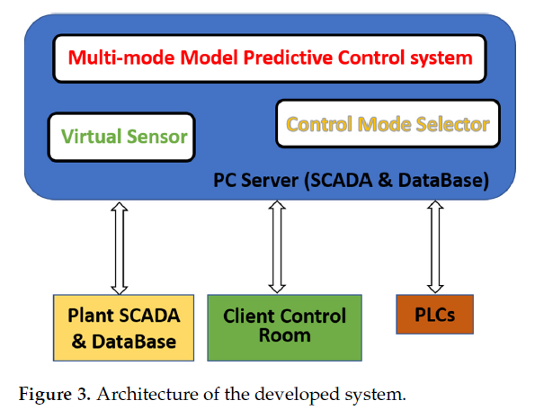
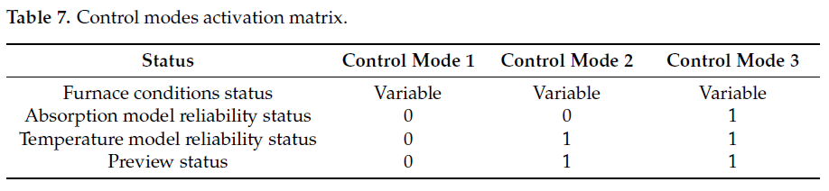
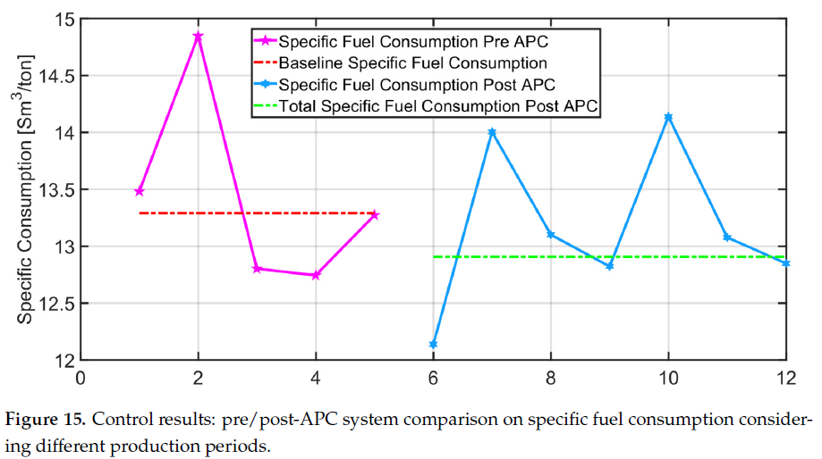

# [2023] Multi-Mode MPC for Steel Billets Reheating Furnaces

## 基礎資訊 
| 欄位 | 內容 |
|------|------|
| 期刊 / 會議 | Sensors 2023, 23, 3966 (MDPI, Open Access, IF: 3.9) |
| 作者與單位 | Silvia Maria Zanoli, Crescenzo Pepe @ Università Politecnica delle Marche; Lorenzo Orlietti @ Alperia Green Future |
| 論文網址 | [doi.org/10.3390/s23083966](https://doi.org/10.3390/s23083966) |
| 原始碼 / 實作 | N/A（部署於工業 SCADA 的專有系統） |
| 技術關鍵字 | `#Multi-Mode-MPC` `#Virtual-Sensor` `#LPV-QP` `#Control-Mode-Selector` `#Billet-Reheating` `#Energy-Efficiency` `#APC-Level2` |

> **作者關聯注意：** Zanoli 與 Pepe 即為本倉庫既有論文 [2017 PusherFurnace-MPC](2017_PusherFurnace-MPC.md) 的原班人馬。本篇為其 2017 年會議論文的完整期刊推廣版，涵蓋三控制模式、多爐型通用化，並附有多廠實測能耗數據。

## 研究摘要 

> 針對鋼鐵廠加熱爐缺乏爐內直接測量且操作條件全天候變動（生產/停機/重啟）的挑戰，提出三元件統一 Level 2 APC 框架：虛擬感測器 + 控制模式選擇器 + 三模 LPV-MPC，實現跨爐型（步進式、推桿式）的全工況節能控制。

鋼坯加熱爐（Billet Reheating Furnace）是熱軋產線的瓶頸工站，其能耗約占整廠碳排的主要部分（全球鋼鐵業 CO₂ 排放約佔人類 7%）。現有 Level 2 系統的痛點有三：（1）爐內鋼坯溫度無法直接量測，迫使仰賴物理模型估算；（2）計畫性/非計畫性停機及重啟使控制架構必須切換策略；（3）不同爐型（Walking Beam vs Pusher）的物理特性差異使單一通用框架極難設計。本文以同一研究組 2017 年推桿爐單模 MPC 為基礎，系統性地推廣至統一框架。

其技術機制在學術上可被視為一個 **「模式感知的線性參數變動預測控制（Mode-Aware LPV-MPC）系統」**：在每個控制週期，控制模式選擇器根據模型可靠度與預覽狀態，從三個 CV 子集中線上選定最適控制模式，LPV-QP 求解器再於被選定的 CV 空間中求解燃料最省的區溫設定值軌跡。

### 核心方法論拆解 Core Methodology

1. **虛擬感測器（Billets' Map）** — 以離散時間輻射模型（Eq. 2, Stefan-Boltzmann）追蹤每塊鋼坯的爐內位置（Eq. 1）與溫度，以對流模型（Eq. 4）追蹤出爐後在軋機端的溫度衰減，再以多元線性迴歸模型（Eq. 6, 5 個特徵：軋機溫度、入爐溫度過濾值、爐內居留時間等）估算 6 個軋機架的電流吸收。輻射模型的發射率係數 ε 透過最小化軋機高溫計誤差與吸收誤差的聯合二次成本函數（Eq. 7-8）進行線上自適應。

2. **控制模式選擇器（Control Mode Selector）** — 根據「爐況狀態（生產/停機/重啟）」、「吸收模型可靠度」、「溫度模型可靠度」及「預覽狀態（Preview Status）」四個布林標誌，透過啟動矩陣（Table 7）在線選定三種控制模式之一，並引入遲滯邏輯（Hysteresis Logic）防止模式抖振（Chattering）。

3. **三模 MPC（Multi-Mode MPC Block）** — 共三種控制模式，對應不同的 CV 子集（Table 8）：
   - **模式 1（最保守）**：僅控煙氣交換器溫度 + 氣閥開度，不使用任何鋼坯模型預測，適用模型不可靠或無預覽時。
   - **模式 2（中等）**：加入鋼坯溫度 CV（$T_{f,j,p_{f,j,i}}$），不控制吸收量。
   - **模式 3（全功能）**：再加入軋機吸收量 CV（$A_{r,j,c}$），為正常生產的主要控制模式。

   MPC 以 QP 求解（MATLAB `quadprog`），預測區間 $H_p(k)$ 線上自適應為所有鋼坯剩餘居留時間最大值；控制區間 $H_u(k)$ 以 `ceil(H_p / r_{H_p-H_u})` 計算，並使用 Move Blocking（Eqs. 12-14）壓縮決策變數。非線性輻射模型透過 LPV 線性化（Eq. 15，以自由響應為展開點）轉化為 QP 可求解形式。

## 實務分析 Practical Analysis

### 資料處理流程 Data Pipeline

原始資料來源：PLC 採集的入爐/出爐光學高溫計（°C）、5 個加熱區的熱電偶（SP/PV）、各區氣/空流量（Nm³/h）、煙氣交換器溫度、6 個軋機架電流吸收（A），以及入口/出口光電感測器（Boolean）。

資料流：PLC → SCADA & Database（PC Server） → 虛擬感測器模組（壞數據偵測：有效性限值、尖峰濾波、凍結偵測） → 更新鋼坯地圖（每坯：位置、溫度估算、發射率）→ 控制模式選擇器（每控制週期更新） → MPC QP 求解 → 輸出區溫設定值 → Level 1 PID 控制器。

關鍵超參數：控制週期（未明確報告，推測為 1 分鐘量級）；MPC 預測區間隨鋼坯位置動態變動；Move Blocking 比例 $r_{H_p-H_u}$；發射率適應邊界 $lb_{d\varepsilon}$, $ub_{d\varepsilon}$（未報告具體值）。

案例爐型：5 區推桿式，容量約 35~40 坯/區（Zone 1），生產速率 0-170 t/h，入爐溫度 30-910°C，目標出爐溫度 950-1070°C。

### 落地瓶頸與風險 

1. **控制模式抖振（Mode Chattering at Boundary）** — 儘管引入遲滯邏輯，當模型可靠度閾值或預覽狀態在邊界條件下快速交替（例如：入爐冷坯使溫度估算誤差週期性突破可靠度門檻），選擇器在模式 2 與模式 3 間持續切換，導致 CV 集合快速交替，破壞 MPC 的連續性假設，造成區溫設定值的大幅振盪。

2. **發射率標量化崩潰（Scalar ε Adaptation Failure under Scale Formation）** — Eq. 7-8 對整個 Reheating/Rolling group 的所有坯坯共用同一個 ε 值進行自適應。爐內高溫區（>1150°C）氧化鐵皮（Scale）生長速率為溫度的非線性函數，不同鋼種（steel composition）的 ε 可差異高達 0.2-0.3。冷坯與熱坯混裝時，單一 ε 會系統性低估冷坯或高估熱坯溫度，使發射率自適應直接誤導控制器。失效條件：不同鋼種或不同入爐溫度的鋼坯被分配至同一 group。

3. **重啟工況 QP 維度爆炸（QP Dimension Blow-up at Restart）** — 停機重啟後，爐內所有坯坯剩餘居留時間接近最大值，$H_p(k) = \max_j \hat{H}_{p,j}(k|k)$ 取全爐最大值。若爐型居留時間約 1.5-2 小時，以分鐘級採樣，預測區間可達 90-120 步。此時 QP 的決策變數矩陣為（全爐坯數 × $H_u$），矩陣維度遠超平時，MATLAB `quadprog` 可能無法在 1 個控制週期內收斂，導致 Level 2 輸出缺失並回退至人工操作。

## 落地性評析 

### 實驗與數據分析 

- **紅旗 Red Flag — 節能認證樣本極少（N=5+7 期）**：Figure 15 的比對以 5 個 APC 安裝前與 7 個安裝後的「選定生產期（selected production periods）」計算燃耗基準線。論文明確說明排除「不顯著生產期（outlier）」的標準為鋼種、入爐溫度分佈、熱裝比例等，但判定「顯著性」的方法論不透明，事實上等同於手選最有利的比對窗口。以 N=12 個數據點認證「約 2% 年度燃耗削減（≈8170 toe）」的經濟效益，統計置信度嚴重不足。

- **紅旗 Red Flag — 無消融實驗，三模貢獻不明**：全文未報告拆除虛擬感測器、控制模式選擇器或任何單一 MPC 模式後的性能降幅（ΔR² 或 ΔRMSEP 均未提供）。2-6% 的節能改善究竟有多少來自三模切換邏輯、多少來自單純的 MPC vs 手動操作效應，完全無從判斷。

- **基準線審查 Baseline Scrutiny**：對照組僅為「操作員手動控制或前一代 Level 2 系統」，無任何現代 MPC、Economic MPC 或 NMPC 的定量比較。對於 2023 年的期刊論文，這屬於典型的「打稻草人（Straw-man baseline）」策略。

- **數據充分性 Data Adequacy**：溫度模型驗證（Fig. 5）在「約 5 小時」窗口內顯示 RMSEP < 10°C（~1% 量測範圍），但未說明訓練集樣本數、訓練時間跨度，或是否跨不同季節/鋼種進行交叉驗證。吸收模型（Fig. 7）展示出相當大的散佈（scatter），文中僅以「可接受的近似」帶過，未給出 R² 或 MAE。實際現場中的關鍵擾動（工具磨損、材質變異、測量偏移）均未被納入壓力測試。

### 未來工作建議 

**理論貢獻評估：**
本文最實質的工程創新在於「控制模式選擇器」與「預測區間線上自適應」兩點，兩者皆非學術層面的新演算法，但作為工業系統的整合設計是有價值的。然而，吸收模型（Eq. 6）為純線性多元迴歸，與 2017 年版本無本質差異；LPV 線性化（Eq. 15）沿用自同組 2017 年架構。因此，本文 2-6% 節能提升的主要驅動力更可能來自「取代了基準極低的手動操作」，而非多模切換本身帶來的邊際增益。

**工程優化建議：**

- **以高斯過程迴歸（GPR）替換線性吸收模型** — 線性 Eq. 6 在 Fig. 7 的散佈圖中明顯欠擬合高溫端。GPR 能同時提供吸收預測的不確定度估計，可用於替代現有「可靠度閾值」邏輯，使控制模式切換自動化且數據驅動，徹底移除需手動設定的閾值參數。

- **技術替代 Alternative technique — Economic MPC（EMPC）**：本文 MPC 以「追蹤溫度約束邊界 + 最小化設定值偏差」為目標，能耗最小化隱含在「推溫度往下界」的行為中。改採以「比燃耗（Sm³/ton）」為直接最小化目標的 EMPC，可消除追蹤設定值的中間層，更直接地對應 KPI，並在停機工況自然退化為純節能模式，無需手動切換。
