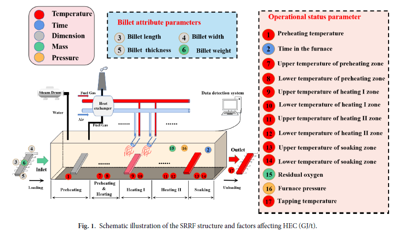
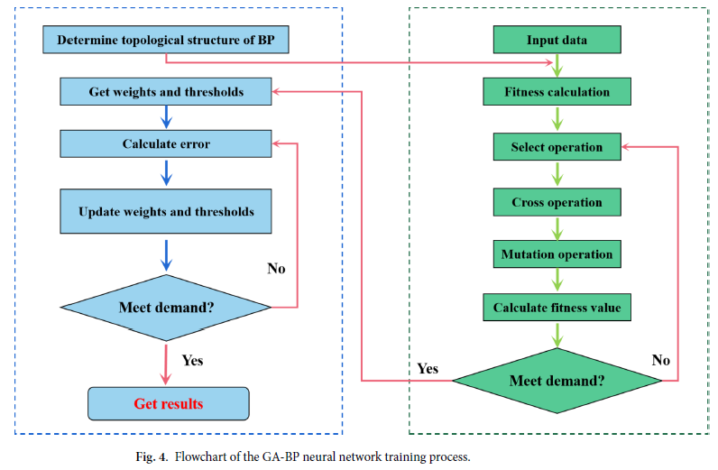
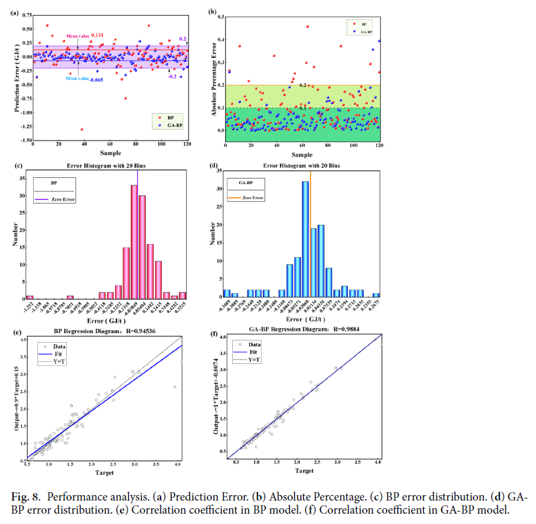

# [2025] GA-BP Prediction Model for Heat Energy Consumption in Steel Rolling Reheating Furnace

## 基礎資訊 Basic Information

| 欄位 | 內容 |
|------|------|
| 期刊 / 會議 | Scientific Reports (Nature Portfolio), 2025, Article 15:11115 (IF: ~4.6) |
| 作者與單位 | Yi Duan, Guang Chen, Xiangjun Bao, Jing Xu, Lu Zhang, Xiaojing Yang @ Anhui University of Technology |
| 論文網址 | [doi.org/10.1038/s41598-025-95134-3](https://doi.org/10.1038/s41598-025-95134-3) |
| 原始碼 / 實作 | N/A (data available from corresponding author on request) |
| 技術關鍵字 | `#GA-BP` `#BPNN` `#HEC` `#SRRF` `#GeneticAlgorithm` `#EnergyPrediction` `#LevenbergMarquardt` |

---

## 研究摘要 

> **一句話核心：** 以遺傳演算法（GA）優化 BP 神經網路的初始權重與閾值，預測鋼鐵輥軋再加熱爐（SRRF）每噸鋼坯熱能耗（HEC，GJ/t），將 MAPE 從 9.76% 降至 5.25%。

鋼鐵輥軋再加熱爐（SRRF）消耗鋼鐵製程 15–20% 的總能源，其每噸鋼坯熱能耗（HEC，單位 GJ/t）受鋼坯尺寸、各爐區溫度、爐壓、殘餘氧含量等 17 個參數的複雜非線性交互影響。傳統機理模型難以量化這些耦合關係，而普通 BP 神經網路容易陷入局部最優並對初始權重高度敏感。

本研究引入遺傳演算法對 BP 網路的初始權重（180 個）與閾值（11 個）進行全局搜索最優化，再以 Levenberg-Marquardt 演算法完成精細訓練，形成 GA-BP 混合架構。以中國某鋼廠 1,200 筆實際生產數據驗證，最終網路結構為 17-10-1（17 輸入、10 隱層節點、1 輸出），測試集 R = 0.9884、MAPE = 5.25%，優於純 BP 的 R = 0.9454、MAPE = 9.76%。

其技術機制在學術上可被視為一個**演化啟發式初始化（evolutionary warm-start）結合梯度下降精調**的兩階段訓練策略：GA 負責跳離局部最優、探索全局權重空間，LM 演算法負責在找到良好初始點後快速收斂。本文核心貢獻在於將此 GA-BP 方法**首次應用於 SRRF 能耗預測**，而非演算法本身的創新。

### 核心方法論拆解

1. **輸入特徵定義（17 因子）** — 4 個鋼坯屬性參數（長、寬、厚、重）+ 13 個操作狀態參數（預熱溫度、爐內時間、預熱/加熱 I/加熱 II/均熱各區上下溫度、殘餘氧含量、爐壓、出爐溫度）；構成完整的 SRRF 物理狀態向量。
2. **資料正規化** — Min-Max 歸一化（公式 3）消除各特徵量綱差異，輸出在反推後還原為 GJ/t 原始尺度。
3. **GA 初始化優化** — 族群大小 P=30、最大進化代數 e=60、交叉率 cro=0.8、變異率 mu=0.2；適應度函數為訓練集與測試集的平均 MSE；第 33 代達到最優適應值 0.00624。
4. **BP 精細訓練** — 以 GA 搜索出的最優初始參數啟動 LM 演算法；最大迭代 1000 次、學習率 0.01、動量因子 0.1；驗證集最佳 MSE = 0.002394 於第 37 epoch 達到。
5. **誤差評估** — 以測試集 120 筆樣本計算 RMSE、MAPE、R，並與純 BP 進行對比。

---

## 實務分析 

### 資料處理流程 

原始資料直接採集自中國某國內鋼廠 SRRF 的生產系統數據偵測裝置，共 1,200 筆樣本，均保留異常值（未移除離群點，以維持真實工況代表性）。切分比例：75% 訓練（900 筆）/ 15% 驗證（180 筆）/ 10% 測試（120 筆）。17 個輸入特徵（billet 屬性 + 操作參數）以 Min-Max 歸一化處理後構成輸入向量 X ∈ ℝ¹⁷；目標輸出為 HEC（GJ/t）。

隱層節點數透過對 5–14 個節點的試誤法（RMSE 衡量）確定為 10，形成最終 17-10-1 架構（Fig. 5）。此架構含 180 個連接權重與 11 個閾值（共 191 個可優化參數），GA 的個體編碼長度即為 191。

### 落地瓶頸與風險 

1. **非因果特徵（Causality Violation）** — 第 17 個輸入特徵「出爐溫度（Tapping Temperature）」在鋼坯離開爐子後才能量測，與 HEC 幾乎同時或之後得知。在實際生產中，若要以此模型進行**預測性能源調控**，出爐溫度在加熱過程中尚未確定，導致模型在控制閉環中無法使用——輸入向量不完整時預測值無意義。
2. **單廠資料分佈偏移（Single-Plant Distribution Shift）** — 模型僅以一家國內鋼廠數據訓練，不同鋼廠的燃氣熱值組成、爐體幾何尺寸、耐火材料老化程度、鋼坯合金牌號分佈均不同。部署至新廠時模型必須重訓，而重訓數據不足（< 900 筆）時極易過擬合。
3. **感測器同步失效（Sensor Synchronization Failure）** — 17 個輸入特徵需同步可用。高溫爐環境下熱電偶漂移、損壞頻繁；任何一個感測器缺值都使整個輸入向量失效，且模型沒有不確定性量化（UQ）機制，不能告知操作員「此預測的可信度為何」。

---

## 落地性評析 

### 實驗與數據分析 

- **紅旗 Red Flags:**
  - **紅旗① 出爐溫度數據洩漏（Data Leakage via Tapping Temperature）** — 出爐溫度（Feature 17）在物理上幾乎是 HEC 的直接因變量，兩者在數據中高度共線性（爐溫越高 → 鋼坯吸熱越多 → HEC 越高）。模型的高 R 值（0.9884）可能主要由此單一特徵驅動，而非真正捕捉了 17 個特徵的複雜交互。若移除出爐溫度重跑消融實驗，模型表現很可能大幅下降——但論文完全未進行此測試。
  - **紅旗② 測試集僅 120 筆** — 聲稱 94.7% 預測準確率的統計基礎極薄，未報告信賴區間。120 筆中僅需 6–7 筆偏差即可使準確率變動 5 個百分點以上。

- **基準線審查 Baseline Scrutiny:** 論文自身的 Table 1 文獻回顧列出了 PSO-BP、Ant Colony-BP、IPOA-LSTM-PCA 等方法，但實驗章節僅與原始 BP 對比——即論文已知的最弱基準線。選擇性忽略更強的對照方法是典型的「稻草人基準（straw-man baseline）」問題。

- **數據充分性 Data Adequacy:** n=1,200 對於 BPNN（191 參數）屬邊界可接受，訓練集:參數比 ≈ 4.7，過擬合風險中等。更大的問題是：資料僅來自單一鋼廠、單一時段，未涵蓋爐具老化不同階段、多鋼坯牌號、不同季節環境溫度等工況邊界，實際代表性存疑。

### 未來工作建議 

**理論貢獻評估：**
本文的核心貢獻是「將 GA-BP 應用於 SRRF 能耗預測的領域首次」，演算法本身（GA + BP）並無創新。性能提升（MAPE 9.76% → 5.25%，降低 46.2%）令人印象深刻，但缺乏消融實驗無法判斷這 46.2% 中有多少來自 GA 初始化、多少來自架構選擇（17-10-1 vs. 其他結構）、多少源於出爐溫度這一強預測因子的引入。

- **移除出爐溫度特徵** — 出爐溫度在生產流程中屬於後驗觀測值，不可作為前饋預測輸入；移除後重新評估，才能確認模型在真實操作場景（鋼坯入爐前預測）中的實際可用性。
- **技術替代 Alternative techniques:**
  - **Gaussian Process Regression (GPR)** — 對 1,200 筆樣本規模優秀，天然提供預測不確定性（信賴區間），無局部最優問題，更適合傳感器缺值時的魯棒推斷。
  - **Physics-Informed Neural Network (PINN)** — 將各爐區的熱傳方程（能量守恆）嵌入損失函數，強制預測值遵從物理約束，可大幅提升跨廠泛化能力，並解決純數據驅動模型在分佈外樣本的外推失效問題。作者在 Perspectives 中已提及此方向，值得優先推進。
